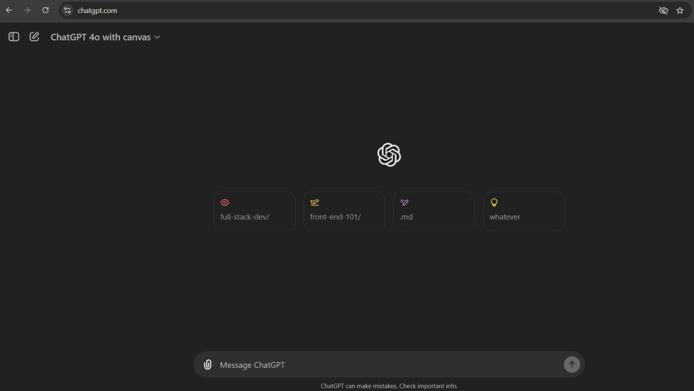

I've researched chatgpt, youtube and skool. The HTML tags that I saw frequently are div, span, p, a and heading tags are basically the building "blocks" that help structure webpages and the content.

